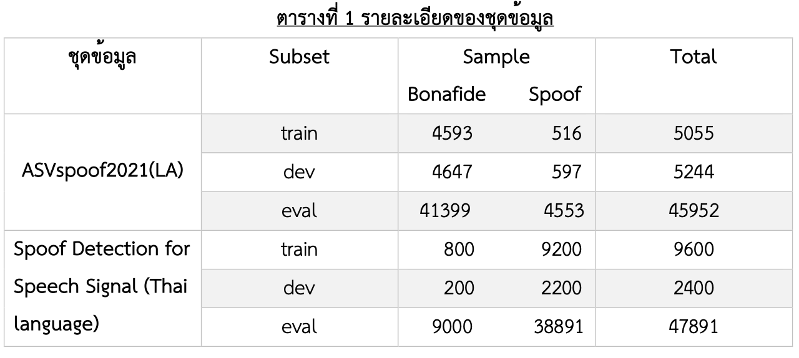
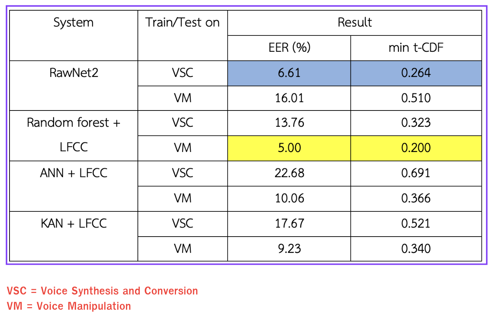

# AI Voice Detector
- The system focuses on comparing metric outputs from Handcraft Feature, Transformer models, and attempting to enhance Rawnet2 with them. 📑[Report](VocalSense_Poster.pdf)

## Dataset

### English
- [ASVspoof 2021](https://www.asvspoof.org/index2021.html) (Large-scale dataset used for AI voice detection competitions, containing both genuine and spoofed voices, total 56251 files or 7.23 GB)

### Thai
- [Mozilla Common Voice Corpus 16.1](https://commonvoice.mozilla.org/th/datasets) First Validated 10000 files (Bonafide)
- [AI For Thai](https://aiforthai.in.th/corpus.php) Fake audio for thai voice 49891 files (Spoof)

- 

## Classifier
- RawNet2
- Random Forest
- ANN (Artificial Neural Networks)
- KAN (Kolmogorov-Arnold Networks)

## Metric
- Accuracy
- min t-DCF (tandem detection cost function)
- EER (Equal Error Rate)

## Our Experiment
- 

## Check our website here 🚀🚀🚀
- https://vocalsense.pythonanywhere.com/
- 
